# mc_auto_boss GPU运行环境搭建教程

> 本文默认读者使用纯净的系统环境，未安装python、conda

## 下载 `miniconda`

[miniconda_py310.exe  conda官网](https://repo.anaconda.com/miniconda/Miniconda3-py310_24.4.0-0-Windows-x86_64.exe)

[miniconda_py310.exe 网盘下载链接](https://cloudreve.caiyun.fun/f/yXCL/miniconda_py310.exe)

## 安装`miniconda`

这部分没啥好说的，无脑下一步就行，但是要记住你conda的安装位置！

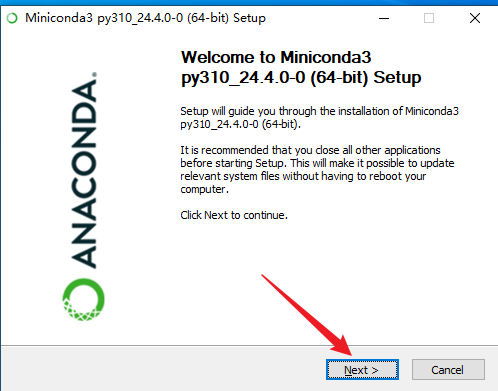

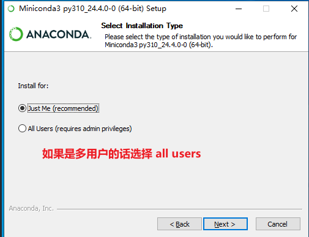

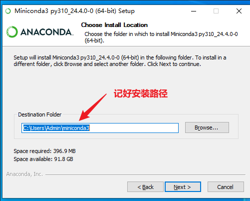

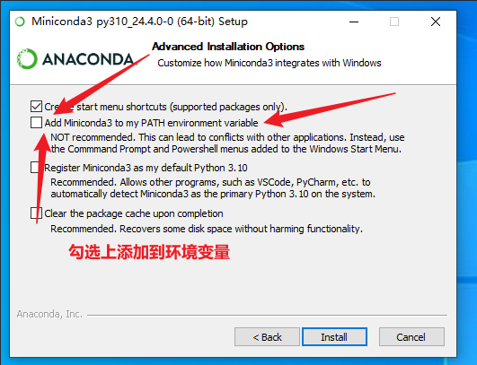

## 初始化`conda`命令

如果在上面安装的过程中选择 `Install for All users`,那么可能没有初始化`conda`命令，使用`conda`会提示没有该命令那么就需要初始化环境。

如果是`all users`安装的话，默认安装位置为：`C:\ProgramData\miniconda3`（具体目录根据你安装时选择的路径为准）

安装完成后，打开`powershell`,进入该目录`C:\ProgramData\miniconda3` 下的`condabin`目录,运行命令：`./conda init`

```bash
C:
cd C:\ProgramData\miniconda3\condabin
./conda init
```

该步骤完成后重启`powershell`后`conda`命令正常就可以使用了

如果出现`因为在此系统上禁止运行脚本。有关详细信息`相关报错，请运行以下命令后重启`powershell`

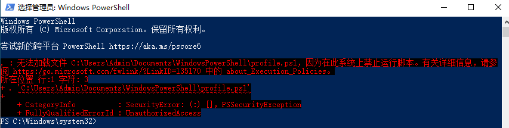

```shell
set-executionpolicy remotesigned
```

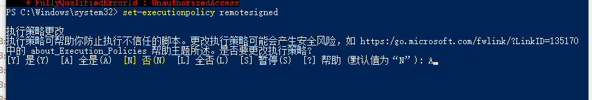

这里输入`A`以后敲回车，重启`powershell`，此时你就应该可以看到命令行路径前面有个`(base)`标识

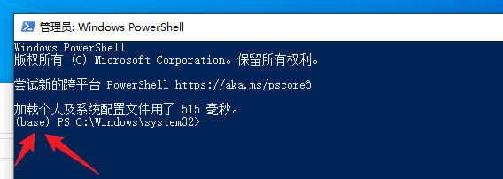

最后检查一下`conda`命令是否能否正常使用

## 创建虚拟环境

### 添加清华源（可选）

对于国内用户无法连接到 Anaconda 官方源的可以按照以下命令添加清华源:

```
conda config --add channels https://mirrors.tuna.tsinghua.edu.cn/anaconda/pkgs/free/
conda config --add channels https://mirrors.tuna.tsinghua.edu.cn/anaconda/pkgs/main/
conda config --set show_channel_urls yes
```

打开`powershell` 默认情况下会进入`conda` `base`虚拟环境下（也有可能没有默认进入），不建议直接使用`base`环境（你非要用也行）,使用以下命令创建虚拟环境`mc`

```
conda create  -n mc python=3.10
```

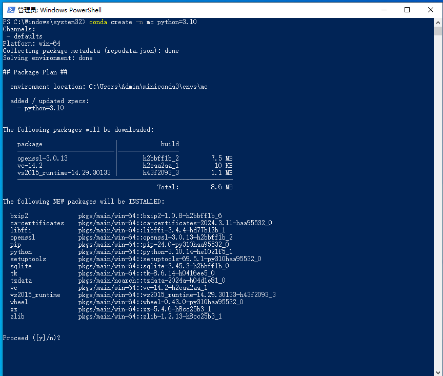

输入命令后会再询问你是否继续，敲回车就行

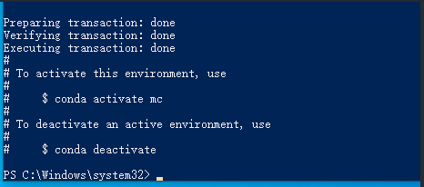

创建完成后会有如上输出

## 安装`paddlepaddle-gpu`

首先进入虚拟环境`mc`

```shell
conda activate mc
```

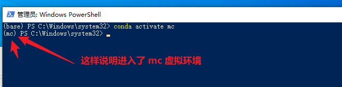

进入`paddle`官网：[飞桨PaddlePaddle-源于产业实践的开源深度学习平台](https://www.paddlepaddle.org.cn/)

复制如下命令：

```shell
conda install paddlepaddle-gpu==2.6.1 cudatoolkit=11.7 -c https://mirrors.tuna.tsinghua.edu.cn/anaconda/cloud/Paddle/ -c conda-forge
```

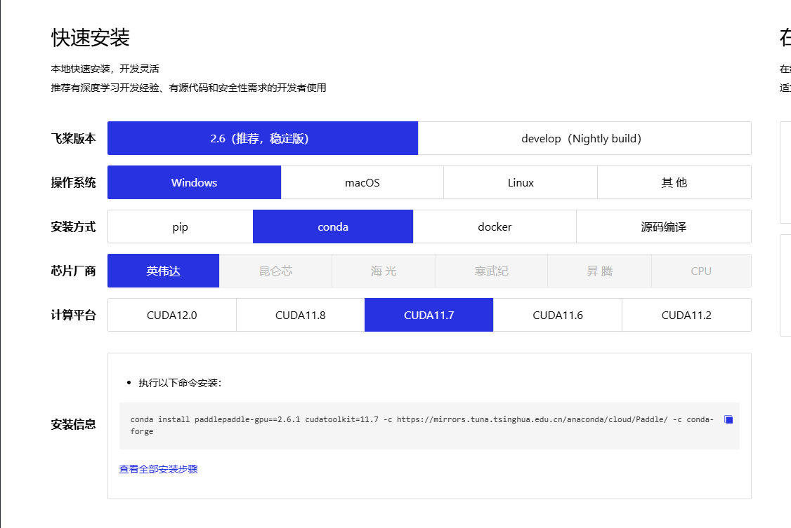

输入命令敲回车后`conda`会让你再次确定是否继续，此时敲回车等着依赖安装完成即可

## 安装其他依赖

首先进入项目根目录,然后执行如下命令,请确保命令行进入了项目根目录！

```
cd C:\mc_auto_boss-gpu #这里是进入项目目录
pip install -r .\requirements.txt
```

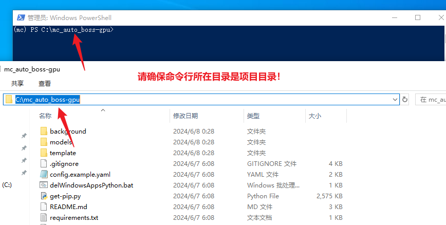

## 启动脚本

等待所有依赖安装完成后，输入以下命令启动脚本

```shell
python .\background\main.py
```

注意，当你关闭`powershell`再打开以后，默认进入的虚拟环境是`base`,此时并不能启动脚本！需要先进入`mc`虚拟环境再启动

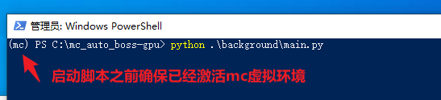

使用如下命令激活`mc`虚拟环境

```shell
conda activate mc
```

